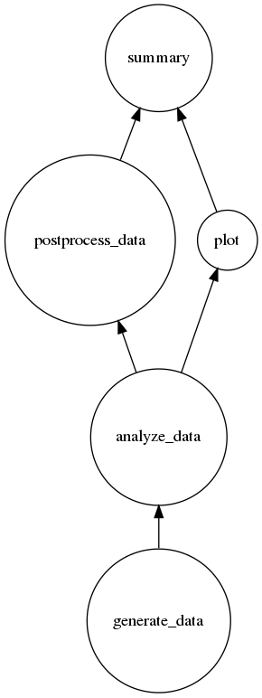

.. _example:

:gitlab_url: https://gitlab.com/isaac-cfwong/slurmpter

*******
Example
*******

This example walks through a common usage of the package with some mock executables.

Suppose now we want to build a workflow of jobs to analyze some simulated data. The workflow consists of

1) Generate simulated data with the executable ``generate-data``.

2) Analyze the simulated data with the executable ``analyze-data``.

3) Post-process the analysis results with the executable ``postprocess-data``, and at the same time generate plots of the analysis results with the executable ``plot``.

4) Summerize the post-processed results and plots in a PDF file with the executable ``summary``.

Be reminded that the above are all mock executables which serve for illustration only. You should not try to find those executables in your machine.

Outline of the walk-through:

- :ref:`job-slurm-object`

- :ref:`job-dir`

- :ref:`slurm_obj`

- :ref:`job_gen_data`

- :ref:`job_analyze_data`

- :ref:`job_postprocess`

- :ref:`job_plot`

- :ref:`job_summary`

- :ref:`build_submit`

- :ref:`visualize`

.. code-block:: python

    from slurmpter import SlurmJob, Slurm

    # Define the error, output and submit directories.
    error = "slurm/error"
    output = "slurm/output"
    submit = "slurm/submit"

    # Instantiate a Slurm object which defines the graph of workflow.
    slurm = Slurm(name="slurm", submit=submit)

    ################
    # Generate data
    ################

    # Instantiate a SlurmJob object for generating simulated data.
    job_gen = SlurmJob(name="generate_data",
                       executable="generate-data",
                       submit=submit,
                       output=output,
                       error=error,
                       slurm=slurm)
    # We would like to generate two sets of data.
    job_gen.add_arg("--output data_0.txt --input input_0.txt")
    job_gen.add_arg("--output data_1.txt --input input_1.txt")

    ###############
    # Analyze data
    ###############

    # Instantiate a SlurmJob object for analyzing the simulated data.
    job_analyze = SlurmJob(name="analyze_data",
                           executable="analyze-data",
                           submit=submit,
                           output=output,
                           error=error,
                           slurm=slurm)
    # Since we must have the simulated data to be generated before doing the analysis, the job_gen is the parent job of job_analyze.
    job_analyze.add_parent(job_gen)
    # We analyze the two sets of data and get the result outputs.
    job_analyze.add_arg("--output result_0.txt --input data_0.txt")
    job_analyze.add_arg("--output result_1.txt --input data_1.txt")

    #######################
    # Post-process results
    #######################

    # Instantiate a SlurmJob object for post-processing the analysis results, e.g. merging the results etc..
    job_postprocess = SlurmJob(name="postprocess_data",
                               executable="postprocess-data",
                               submit=submit,
                               output=output,
                               error=error,
                               slurm=slurm)
    # The result outputs have to be ready before we do the post-processing, so the job_analyze is the parent job of job_postprocess.
    job_postprocess.add_parent(job_analyze)
    # We post-process the result outputs i.e. result_0.txt and result_1.txt.
    job_postprocess.add_arg("--output proprocessed_results.txt --input result_0.txt result_1.txt")

    ###################
    # Plot the results
    ###################

    # Instantiate a SlurmJob object for plotting the analysis results.
    job_plot = SlurmJob(name="plot",
                        executable="plot",
                        submit=submit,
                        output=output,
                        error=error,
                        slurm=slurm)
    # Plotting only needs the analysis results, so it can happen concurrently with post-processing.
    job_plot.add_parent(job_analyze)
    # Generate plots of each of the analysis results.
    job_plot.add_arg("--output result_0_plot.pdf --input result_0.txt")
    job_plot.add_arg("--output result_1_plot.pdf --input result_1.txt")

    #####################
    # Generate a summary
    #####################

    # Instantiate a SlurmJob object for generating summary.
    job_summary = SlurmJob(name="summary",
                           executable="generate-summary",
                           submit=submit,
                           output=output,
                           error=error,
                           slurm=slurm)
    # The summary file needs the post-processed result and the plots.
    job_summary.add_parents([job_postprocess,job_plot])
    # Generate the summary as a PDF document.
    job_summary.add_arg("--output summary.pdf --input processed_results.txt result_0_plot.pdf result_1_plot.pdf")

    # Build the submit files.
    slurm.build()
    # Call build_submit() if you want to submit the jobs immediately after the build.
    # slurm.build_submit()

You should see the following submit files in ``slurm/submit`` if they are successfully built.

``slurm_<date>_01.submit``:

.. code-block:: bash

    #!/bin/bash
    #SBATCH --job-name=slurm_<date>_01
    #SBATCH --output=slurm/submit/slurm_<date>_01.output
    #SBATCH --error=slurm/submit/slurm_<date>_01.error

    jid0=($(sbatch slurm/submit/generate_data_<date>_01.submit))
    jid1=($(sbatch --dependency=afterok:${jid0[-1]} slurm/submit/analyze_data_<date>_01.submit))
    jid2=($(sbatch --dependency=afterok:${jid1[-1]} slurm/submit/postprocess_data_<date>_01.submit))
    jid3=($(sbatch --dependency=afterok:${jid1[-1]} slurm/submit/plot_<date>_01.submit))
    jid4=($(sbatch --dependency=afterok:${jid2[-1]}:${jid3[-1]} slurm/submit/summary_<date>_01.submit))

``generate_data_<date>_01.submit``:

.. code-block:: bash

    #!/bin/bash
    #SBATCH --job-name=generate_data_<date>_01
    #SBATCH --output=slurm/output/generate_data_<date>_01.output
    #SBATCH --error=slurm/error/generate_data_<date>_01.error

    srun --ntasks=1 --exclusive generate-data --output data_0.txt --input input_0.txt &
    srun --ntasks=1 --exclusive generate-data --output data_1.txt --input input_1.txt &
    wait

``analyze_data_<date>_01.submit``:

.. code-block:: bash

    #!/bin/bash
    #SBATCH --job-name=analyze_data_<date>_01
    #SBATCH --output=slurm/output/analyze_data_<date>_01.output
    #SBATCH --error=slurm/error/analyze_data_<date>_01.error

    srun --ntasks=1 --exclusive analyze-data --output result_0.txt --input data_0.txt &
    srun --ntasks=1 --exclusive analyze-data --output result_1.txt --input data_1.txt &
    wait

``postprocess_data_<date>_01.submit``:

.. code-block:: bash

    #!/bin/bash
    #SBATCH --job-name=postprocess_data_<date>_01
    #SBATCH --output=slurm/output/postprocess_data_<date>_01.output
    #SBATCH --error=slurm/error/postprocess_data_<date>_01.error

    srun --ntasks=1 --exclusive postprocess-data --output proprocessed_results.txt --input result_0.txt result_1.txt &
    wait

``plot_<date>_01.submit``:

.. code-block:: bash

    #!/bin/bash
    #SBATCH --job-name=plot_<date>_01
    #SBATCH --output=slurm/output/plot_<date>_01.output
    #SBATCH --error=slurm/error/plot_<date>_01.error

    srun --ntasks=1 --exclusive plot --output result_0_plot.pdf --input result_0.txt &
    srun --ntasks=1 --exclusive plot --output result_1_plot.pdf --input result_1.txt &
    wait

``summary_<date>_01.submit``:

.. code-block:: bash

    #!/bin/bash
    #SBATCH --job-name=summary_<date>_01
    #SBATCH --output=slurm/output/summary_<date>_01.output
    #SBATCH --error=slurm/error/summary_<date>_01.error

    srun --ntasks=1 --exclusive summary --output summary.pdf --input processed_results.txt result_0_plot.pdf result_1_plot.pdf &
    wait

You can either call ``slurm.build_submit()`` to squentially build and submit the jobs or call ``slurm.submit_slurm()`` to submit the jobs after the submit files are built. Alternatively, you can type the following command to submit the jobs after the submit files are built:

.. code-block:: bash

    sbatch slurm_<date>_01.submit

.. _job-slurm-object:

--------------------------
SlurmJob and Slurm objects
--------------------------

.. code-block:: python

    from slurmpter import SlurmJob, Slurm

``Slurm`` is a collection of ``SlurmJob`` which could have different priorities to run using Slurm.

.. _job-dir:

---------------
Job directories
---------------

.. code-block:: python

    error = "slurm/error"
    output = "slurm/output"
    submit = "slurm/submit"

The submit files are built in the ``submit`` directory, and also the standard output and standard error from ``Slurm`` are written into the ``submit`` directory. The standard output and standard error from the ``SlurmJob`` are written into the ``output`` and ``error`` directories respectively.

.. _slurm_obj:

------------------------
Construct a Slurm object
------------------------

.. code-block:: python

    # Instantiate a Slurm object which defines the graph of workflow.
    slurm = Slurm(name="slurm", submit=submit)

You have to first construct a ``Slurm`` which will hold all the ``SlurmJob``. The ``name`` of the object defines the prefix of the ouput submit file, and therefore you should use different names for all ``Slurm`` and ``SlurmJob`` objects.

.. _job_gen_data:

---------------------------------------------------------
Construct a SlurmJob object for generating simulated data
---------------------------------------------------------

.. code-block:: python

    ################
    # Generate data
    ################

    # Instantiate a SlurmJob object for generating simulated data.
    job_gen = SlurmJob(name="generate_data",
                       executable="generate-data",
                       submit=submit,
                       output=output,
                       error=error,
                       slurm=slurm)
    # We would like to generate two sets of data.
    job_gen.add_arg("--output data_0.txt --input input_0.txt")
    job_gen.add_arg("--output data_1.txt --input input_1.txt")

Usage of ``generate-data``:

.. code-block:: bash

    generate-data --output <output> --input <input>``
    
``generate-data`` ingests the input file ``<input>`` and writes the simulated data to ``<output>``.

``name`` defines the name of the job. ``executable`` is the name of the executable. You should make sure ``executable`` can be found in ``PATH``. ``slurm=slurm`` adds this ``SlurmJob`` object to the ``Slurm`` object ``slurm`` that we created above.

Two arguments are added to the job via ``job_gen.add_arg()``. The ``SlurmJob`` then defines two independent runs with the commands

.. code-block:: python

    generate-data --output data_0.txt --input input_0.txt
    
    generate-data --output data_1.txt --input input_1.txt

respectively. The two runs can occur concurrently.

.. _job_analyze_data:

----------------------------------------------
Construct a SlurmJob object for analyzing data
----------------------------------------------

.. code-block:: python

    ###############
    # Analyze data
    ###############

    # Instantiate a SlurmJob object for analyzing the simulated data.
    job_analyze = SlurmJob(name="analyze_data",
                           executable="analyze-data",
                           submit=submit,
                           output=output,
                           error=error,
                           slurm=slurm)
    # Since we must have the simulated data to be generated before doing the analysis, the job_gen is the parent job of job_analyze.
    job_analyze.add_parent(job_gen)
    # We analyze the two sets of data and get the result outputs.
    job_analyze.add_arg("--output result_0.txt --input data_0.txt")
    job_analyze.add_arg("--output result_1.txt --input data_1.txt")

Usage of ``analyze-data``:

.. code-block:: bash

    analyze-data --output <output> --input <input>

``analyze-data`` ingests the simulated data ``<input>`` and outputs the analysis result to ``<output>``.

Here the ``job_analyze`` ingests the output files ``data_0.txt`` and ``data_1.txt`` from ``job_gen`` and writes the anlysis results to ```result_0.txt`` and ``result_1.txt`` respectively. ``job_analyze.add_parent(job_gen)`` forces the ``job_analyze`` to start after ``job_gen`` has completed all the runs and all exit normally.

.. _job_postprocess:

----------------------------------------------
Construct a SlurmJob object for postprocessing
----------------------------------------------

.. code-block:: python

    #######################
    # Post-process results
    #######################

    # Instantiate a SlurmJob object for post-processing the analysis results, e.g. merging the results etc..
    job_postprocess = SlurmJob(name="postprocess_data",
                               executable="postprocess-data",
                               submit=submit,
                               output=output,
                               error=error,
                               slurm=slurm)
    # The result outputs have to be ready before we do the post-processing, so the job_analyze is the parent job of job_postprocess.
    job_postprocess.add_parent(job_analyze)
    # We post-process the result outputs i.e. result_0.txt and result_1.txt.
    job_postprocess.add_arg("--output proprocessed_results.txt --input result_0.txt result_1.txt")

Usage of ``postprocess-data``:

.. code-block:: bash

    postprocess-data --output <output> --input <intput>

``postprocess-data`` ingests the result files ``<input>`` and writes the processed data to ``<output>``.

The job must occur after ``job_analyze`` completes all the runs to have the result files ready for post-processing.

.. _job_plot:

-----------------------------------------------
Construct a SlurmJob object for plotting result
-----------------------------------------------

.. code-block:: python

    ###################
    # Plot the results
    ###################

    # Instantiate a SlurmJob object for plotting the analysis results.
    job_plot = SlurmJob(name="plot",
                        executable="plot",
                        submit=submit,
                        output=output,
                        error=error,
                        slurm=slurm)
    # Plotting only needs the analysis results, so it can happen concurrently with post-processing.
    job_plot.add_parent(job_analyze)
    # Generate plots of each of the analysis results.
    job_plot.add_arg("--output result_0_plot.pdf --input result_0.txt")
    job_plot.add_arg("--output result_1_plot.pdf --input result_1.txt")

Usage of ``plot``:

.. code-block:: bash

    plot --output <output> --input <input>

``plot`` ingests a result file ``<input>`` and generates the plot to ``<output>``.

Similar to ``job_postprocess``, ``job_plot`` must occur after ``job_analyze`` to have all the result files ready for plotting.

Notice that the parents of ``job_postprocess`` and ``job_plot`` are both ``job_analyze``, but ``job_postprocess`` and ``job_plot`` do not depend on each other. ``job_postprocess`` and ``job_plot`` can occur concurrently after ``job_analyze`` finishes.

.. _job_summary:

----------------------------------------------------
Construct a SlurmJob object for generating a summary
----------------------------------------------------

.. code-block:: python

    #####################
    # Generate a summary
    #####################

    # Instantiate a SlurmJob object for generating summary.
    job_summary = SlurmJob(name="summary",
                           executable="generate-summary",
                           submit=submit,
                           output=output,
                           error=error,
                           slurm=slurm)
    # The summary file needs the post-processed result and the plots.
    job_summary.add_parents([job_postprocess,job_plot])
    # Generate the summary as a PDF document.
    job_summary.add_arg("--output summary.pdf --input processed_results.txt result_0_plot.pdf result_1_plot.pdf")

Usage of ``summary``:

.. code-block:: bash

    summary --output <output> --input <intput>

``summary`` ingests the post-processed data and plots ``<input>`` and writes a summary file to ``<output>``.

``job_summary`` depends on two jobs i.e. ``job_postprocess`` and ``job_plot``. You can add multiple jobs as the parents at the same time by passing a list of jobs to ``add_parents``.

.. _build_submit:

-------------------------
Build and submit the jobs
-------------------------

.. code-block:: python

    # Build the submit files.
    slurm.build()
    # Call build_submit() if you want to submit the jobs immediately after the build.
    # slurm.build_submit()

You can either call ``build()`` to build the submit files but do not submit the jobs yet, or call ``build_submit()`` to build the submit files and then submit the jobs immediately.

.. _visualize:

----------------------
Visualize the workflow
----------------------

.. code-block:: python

    slurm.visualize("workflow.pdf")

You can generate a figure of the workflow by calling ``visualize()`` of the ``Slurm`` object.


